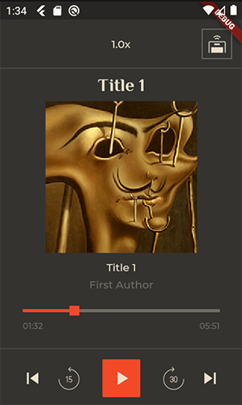

# Flutter demo audio_players on background via audio_service

Implementation [audioplayers](https://pub.dev/packages/audioplayers) working in background via [audio_service](https://pub.dev/packages/audio_service)

Supporting features:
- play\pause track
- next\previous track
- seek track position by dragging slider and buttons
- control playback speed
- control playback route (speaker\earpiece)

UI fully separated from logic. Playback state control by [bloc library](https://pub.dev/packages/bloc)

